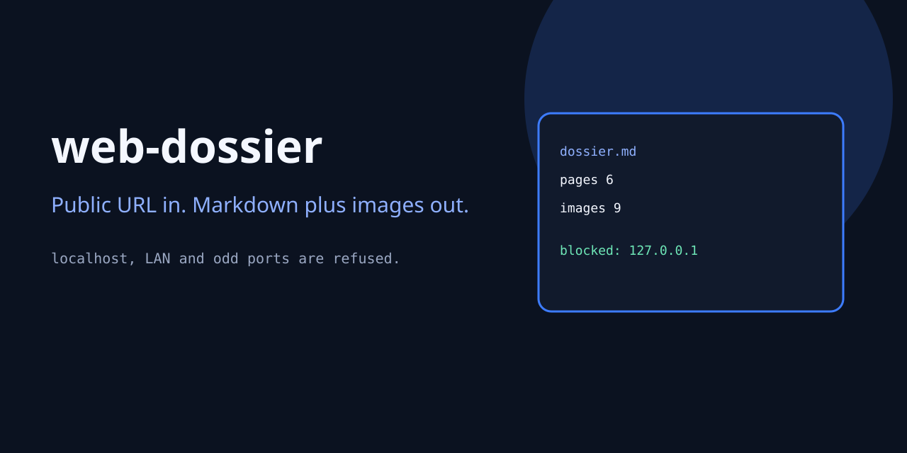
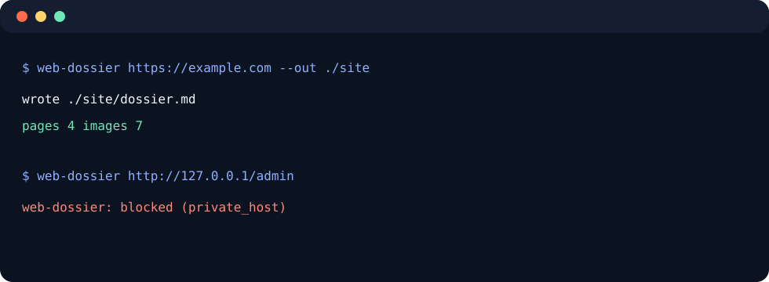

# web-dossier

[](LICENSE)
[](https://www.python.org/downloads/)
[](https://github.com/ironeye11-bot/web-dossier/actions/workflows/ci.yml)


<p align="center">
  
</p>
<p align="center">
  
</p>

**Public URL in. Markdown plus images out.**

Same-site crawl with hard caps. Localhost, private LAN, link-local, credentials in the URL and ports other than 80/443 are refused. Redirects are checked again. No cloud account. No telemetry.

<p align="center">
  
</p>

## Install

```bash
pip install git+https://github.com/ironeye11-bot/web-dossier.git
```

## Use

```bash
web-dossier https://example.com --out ./site
web-dossier https://example.com --pages 6 --images 10 --json
web-dossier http://127.0.0.1/admin
# blocked (private_host)
```

Writes:

```
site/dossier.md
site/pages.json
site/assets/…
```

## What it will not do

- fetch `localhost`, `127.0.0.1`, `10.*`, `192.168.*`, `169.254.*`
- follow a redirect onto those hosts
- open `file:`, `ftp:`, or port `8080`
- run JavaScript
- log in

## Tests

```bash
python3 -m unittest discover -s tests -v
```

## License

MIT
